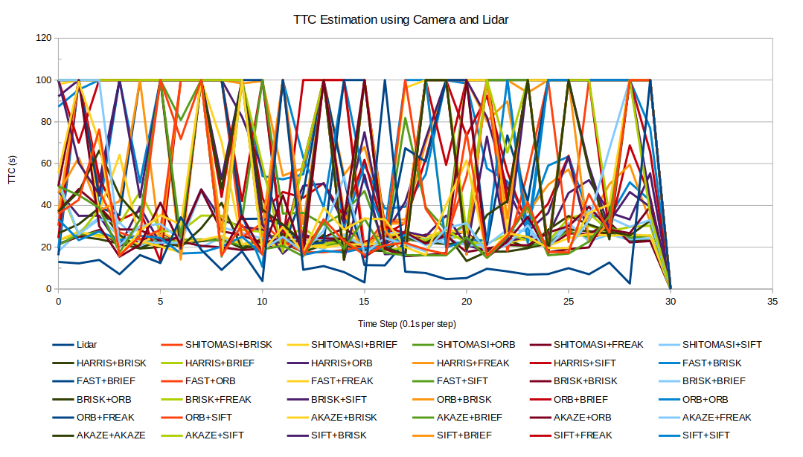
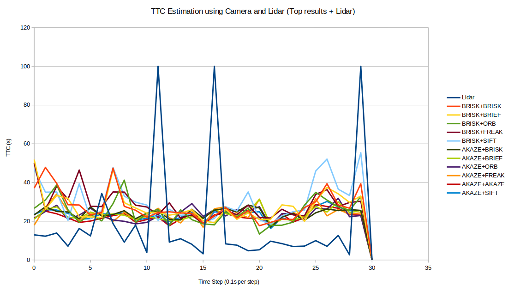
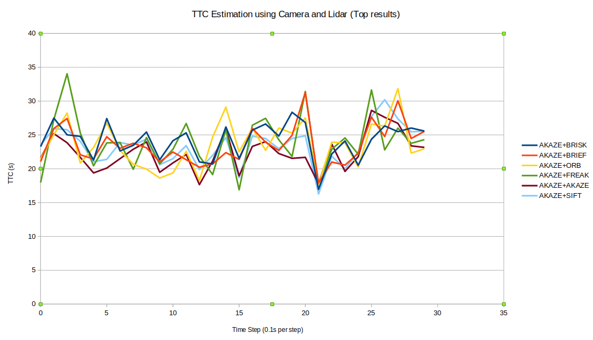

# SFND 3D Object Tracking

Welcome to the final project of the camera course. By completing all the lessons, you now have a solid understanding of keypoint detectors, descriptors, and methods to match them between successive images. Also, you know how to detect objects in an image using the YOLO deep-learning framework. And finally, you know how to associate regions in a camera image with Lidar points in 3D space. Let's take a look at our program schematic to see what we already have accomplished and what's still missing.

In this final project, you will implement the missing parts in the schematic. To do this, you will complete four major tasks: 
1. First, you will develop a way to match 3D objects over time by using keypoint correspondences. 
2. Second, you will compute the TTC based on Lidar measurements. 
3. You will then proceed to do the same using the camera, which requires to first associate keypoint matches to regions of interest and then to compute the TTC based on those matches. 
4. And lastly, you will conduct various tests with the framework. Your goal is to identify the most suitable detector/descriptor combination for TTC estimation and also to search for problems that can lead to faulty measurements by the camera or Lidar sensor. In the last course of this Nanodegree, you will learn about the Kalman filter, which is a great way to combine the two independent TTC measurements into an improved version which is much more reliable than a single sensor alone can be. But before we think about such things, let us focus on your final project in the camera course. 

## Dependencies for Running Locally
* cmake >= 2.8
  * All OSes: [click here for installation instructions](https://cmake.org/install/)
* make >= 4.1 (Linux, Mac), 3.81 (Windows)
  * Linux: make is installed by default on most Linux distros
  * Mac: [install Xcode command line tools to get make](https://developer.apple.com/xcode/features/)
  * Windows: [Click here for installation instructions](http://gnuwin32.sourceforge.net/packages/make.htm)
* Git LFS
  * Weight files are handled using [LFS](https://git-lfs.github.com/)
* OpenCV >= 4.1
  * This must be compiled from source using the `-D OPENCV_ENABLE_NONFREE=ON` cmake flag for testing the SIFT and SURF detectors.
  * The OpenCV 4.1.0 source code can be found [here](https://github.com/opencv/opencv/tree/4.1.0)
* gcc/g++ >= 5.4
  * Linux: gcc / g++ is installed by default on most Linux distros
  * Mac: same deal as make - [install Xcode command line tools](https://developer.apple.com/xcode/features/)
  * Windows: recommend using [MinGW](http://www.mingw.org/)

## Basic Build Instructions

1. Clone this repo.
2. Make a build directory in the top level project directory: `mkdir build && cd build`
3. Compile: `cmake .. && make`
4. Run it: `./3D_object_tracking`.

## Student Implementation

#### FP.1 Match 3D Objects

The `matchBoundingBoxes()` function associates bounding boxes in the previous frame to the bounding boxes in the current frame using the keypoint matches extracted from the images. 

The function first loop through every keypoint pair and test if this pair of keypoints each belongs to a bounding box in their own time frame. If this pair satisfies this criteria, a counter will add one. After all matched keypoints are tested, the bounding box in the previous frame will be associated to the bounding box in the current frame that provides the most number of matched keypoint pairs. 

#### FP.2 Compute Lidar-based TTC

The `computeTTCLidar()` function and its helper function `computeMinDistanceLidar()` compute the minimum distance between the 3D object in front and the ego vehicle and use a constant velocity model to derive the TTC in seconds. 

To minimize errors due to outliers, the `computeMinDistanceLidar()` function first filter out the points that have a low reflectivity value and then perform a euclidean clustering on the point cloud to filter out outliers. Then, the remaining points within the object are used to compute the minimum distance to the ego vehicle and the TTC is thsu computed.

#### FP.3 Associate Keypoint Correspondences with Bounding Boxes

The `clusterKptMatchesWithROI()` function checks every matched keypoint pairs to see if they each is positioned within a bounding box in their respective time frame. The keypoint pairs that satisfy this criterion will be added to their respective bounding boxes. 

#### FP.4 Compute Camera-based TTC

The `computeTTCCamera()` loops through all keypoint matches to compute the distances between every points within the same frame. Then the mediums values from the previous frame and the current frame are selected to compute the distance ratio during time  `dt`. The camera-based TTC can be thus computed using the constant velocity model. 

#### FP.5 Performance Evaluation 1

The comparison between the Lidar-based TTC and the manually estimated TTC are shown below:

| Frame    | Distance | Lidar-based TTC | Manually Est. TTC |
| -------- | -------- | --------------- | ----------------- |
| 0        | 7.97     | /               | /                 |
| 1        | 7.91     | 12.97           | 13.18             |
| 2        | 7.85     | 12.26           | 13.08             |
| 3        | 7.79     | 13.92           | 12.98             |
| 4        | 7.68     | 7.12            | 6.98              |
| 5        | 7.64     | 16.25           | 19.1              |
| 6        | 7.58     | 12.42           | 12.63             |
| 7        | 7.55     | 34.34           | 25.17             |
| 8        | 7.47     | 9.34            | 9.34              |
| 9        | 7.43     | 18.13           | 18.58             |
| 10       | 7.39     | 18.03           | 18.48             |
| ***11*** | 7.20     | ***3.83***      | 3.78              |
| 12       | 7.27     | 99.99 (+oo)     | +oo               |
| 13       | 7.19     | 9.22            | 9.00              |
| 14       | 7.13     | 10.97           | 11.88             |
| 15       | 7.04     | 8.09            | 7.82              |
| ***16*** | 6.83     | ***3.18***      | 3.25              |
| 17       | 6.90     | 99.99 (+oo)     | +oo               |
| 18       | 6.81     | 8.31            | 7.57              |

**Observation:** the filtering of Lidar point cloud effectively erased the outliers thus making the Lidar-based TTC very close to the manually estimated values based on the top view. 

**Imperfection Cases**: 

* At frame 11: There was a disturbance in the Lidar measurement, causing a very short TTC result, which could lead to a sudden brake for the self-driving ego vehicle. 

​													Frame 11: Dash cam view and top view

​	

​														Frame 12: Dash cam view and top view

* At frame 16: Similar to frame 11, an inconsistence distance measurement between the current frame and its preceding and following frame, causing a sudden drop in TTC and then a huge increase (to infinity)

#### FP.5 Performance Evaluation 2

All combinations of detectors + descriptors are tested and the results are shown in `TTC_results.csv`

An overview is shown below: 

**Notes**: 

* The max allowable TTC value is limited to 99.99 to help visual the results better
* The image sequence selected was between 0-30, since the vehicle motion was too little after `k = 30` causing the estimation of TTC value to be unreliable. 

Among all the combinations, the difference in result is huge. From the overall result, the top combinations that could produce more reliable result are shown here (in comparison with Lidar): 

As shown in the figure, the top 6 choices of detector + descriptor combinations are:

* AKAZE + one of the six descriptors

However, there are still huge errors in the estimated TTC value due to a variety of factors:

* The inconsistency / low number of matched keypoints on the target vehicle
* The influence from the change in view angle (as we approaching nearer to the front vehicle, our view point becomes relatively higher and higher)
* The false positives in matching
* Outliers keypoints